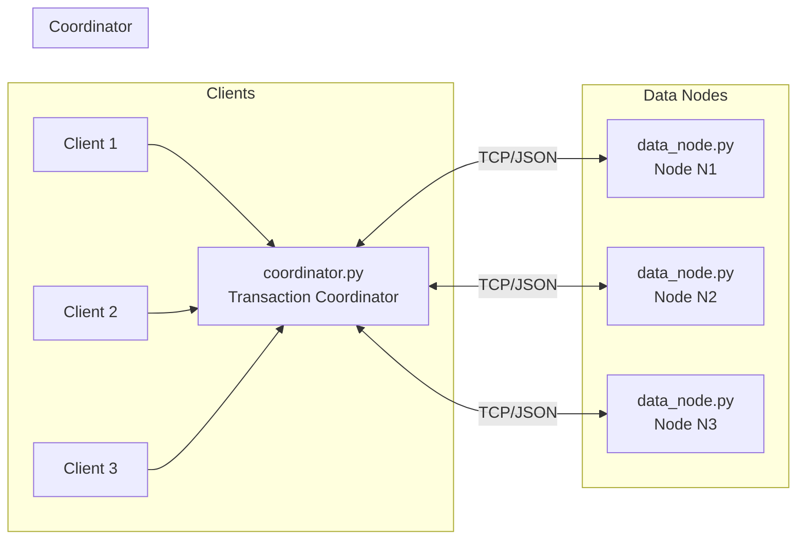
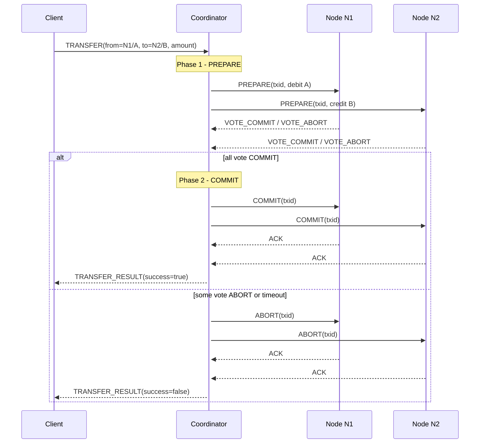

## Distributed Transaction Demo (4 Nodes, Python)

This project is a **small-scale distributed transaction system** implemented in **Python** to illustrate:

- **Atomic distributed transactions** coordinated across multiple nodes
- **Concurrency control** using locks (2PL-style)
- **Failure handling and recovery** with simple write-ahead logging and restart behavior
- A **4-node architecture**: 1 coordinator + 3 data nodes

It is designed to match the assignment requirements you provided (transactions, concurrency, and failures) while keeping the code size and concepts manageable.

---

### 1. High-Level Idea

- **Scenario**: We model a **bank transfer** as a transaction:
  - Debit account `A` on one node
  - Credit account `B` on another node
- **Nodes**:
  - `Coordinator` – runs a simple **two-phase commit** (2PC) protocol
  - `Data Nodes` – `N1`, `N2`, `N3` – each stores a subset of accounts and enforces **locking** and **local checks**
- **Atomicity**:
  - Either **both debit and credit happen** (all nodes commit)
  - Or **nothing happens** (all nodes abort)
- **Concurrency control**:
  - Nodes use **per-account locks** to serialize conflicting updates (basic **2-phase locking** style).
- **Failure handling**:
  - Nodes use a **write-ahead log** plus **state file**.
  - If a data node crashes and restarts, it can still **resume from its last committed state**, and in-flight transactions are safely aborted from the coordinator’s point of view.

---

### 2. Architecture Diagram

The system has **4 processes**:

- 1 × `coordinator.py`
- 3 × `data_node.py` (N1, N2, N3)
- Many clients (`client.py` or any TCP client) can connect to the coordinator concurrently.

#### 2.1 System Architecture Diagram

The following diagram shows the **high-level system architecture** and how components interact:



**What this diagram shows:**

- **Clients** (left side): Multiple client processes (`client.py`) can run concurrently. Each client initiates transactions (e.g., bank transfers) by sending `TRANSFER` requests to the coordinator over TCP/JSON.

- **Coordinator** (middle): The `coordinator.py` process acts as the central transaction manager. It:
  - Receives transaction requests from clients
  - Orchestrates the two-phase commit protocol across data nodes
  - Makes the final commit/abort decision to ensure atomicity
  - Does NOT store account data itself (only coordinates)

- **Data Nodes** (right side): Three independent `data_node.py` processes (N1, N2, N3) that:
  - Store actual account balances (partitioned across nodes)
  - Process sub-transactions (debits/credits) for accounts they manage
  - Use locks for concurrency control
  - Persist state to disk for crash recovery

- **Communication**: All communication uses TCP sockets with JSON-encoded messages. The coordinator communicates bidirectionally with each data node to execute the 2PC protocol.

#### 2.2 Transaction Flow Sequence Diagram (2PC Protocol)

The following sequence diagram illustrates **exactly what happens** during a single distributed transaction:



**What this sequence diagram shows:**

1. **Client Request**: A client sends a `TRANSFER` request to the coordinator specifying:
   - Source: `N1/A` (account A on node N1)
   - Destination: `N2/B` (account B on node N2)
   - Amount to transfer

2. **Phase 1 - PREPARE** (Voting Phase):
   - Coordinator generates a unique transaction ID (`txid`)
   - Coordinator sends `PREPARE` messages to **both involved nodes** (N1 and N2)
   - Each node:
     - Acquires locks on the affected account(s)
     - Validates the operation (e.g., checks if debit would cause negative balance)
     - Logs the prepare intent
     - Replies with `VOTE_COMMIT` (if feasible) or `VOTE_ABORT` (if not)

3. **Phase 2 - COMMIT or ABORT** (Decision Phase):
   - **If all nodes vote COMMIT**:
     - Coordinator sends `COMMIT` messages to all involved nodes
     - Nodes apply the changes permanently (update balances, persist to disk)
     - Nodes send `ACK` back to coordinator
     - Coordinator returns `success=true` to the client
   - **If any node votes ABORT or times out**:
     - Coordinator sends `ABORT` messages to all involved nodes
     - Nodes release locks and discard the prepared changes
     - Nodes send `ACK` back to coordinator
     - Coordinator returns `success=false` to the client

4. **Atomicity Guarantee**: The transaction is **all-or-nothing**:
   - Either both debit (N1) and credit (N2) happen together
   - Or neither happens (both abort)
   - This ensures the system never enters an inconsistent state where money disappears or appears from nowhere

---

### 3. Components and Responsibilities

- **`coordinator.py`**
  - TCP server accepting **client connections**.
  - Implements **two-phase commit** across the nodes:
    - Phase 1 (**PREPARE**): ask each involved node if the transaction is locally feasible.
    - Phase 2 (**COMMIT/ABORT**): commit at all prepared nodes or abort at all.
  - Manages a **simple timeout** and logs failures to reach nodes.

- **`data_node.py`** (N1, N2, N3)
  - TCP server that receives **PREPARE, COMMIT, ABORT, READ** messages.
  - Keeps an **in-memory account map**: account ID → integer balance.
  - Uses **per-account locks** to implement basic **2-phase locking** (2PL-like) for concurrent transactions.
  - Uses a **write-ahead log** plus **state file** for recovery:
    - State file: current persisted balances.
    - Log file: append-only records of changes and transaction events.

- **`client.py`**
  - Simple **CLI client** that connects to the coordinator and sends a `TRANSFER` request.
  - Multiple instances can be run concurrently from different shells to model multiple clients.

- **`common.py`**
  - Utility functions for **JSON-over-TCP** (`send_json`, `recv_json`).

---

### 4. How the Protocol Works (Conceptual View)

#### 4.1 Transaction Model

- A **transaction** is a logical transfer:
  - `from_node`, `from_account` → **debit**
  - `to_node`, `to_account` → **credit**
  - **Amount** is an integer.
- The coordinator builds a **per-node operation list**:
  - On the `from_node`: `{ account_id: from_account, delta: -amount }`
  - On the `to_node`: `{ account_id: to_account, delta: +amount }`

#### 4.2 Two-Phase Commit (2PC)

1. **Client → Coordinator**
   - Client sends a JSON message:
     - `{"type": "TRANSFER", "from_node": "...", "from_account": "...", "to_node": "...", "to_account": "...", "amount": N}`

2. **Phase 1: PREPARE**
   - Coordinator generates a **transaction ID** (`txid`).
   - Sends a `PREPARE` message to each **involved node**:
     - `{"type": "PREPARE", "txid": txid, "operations": [ ... ]}`
   - Each node:
     - Acquires **locks** for all referenced accounts (sorted order to reduce deadlocks).
     - Simulates the operations on a **temporary balance table**.
     - If any balance would go **negative**, replies `VOTE_ABORT`.
     - If all operations are locally feasible, appends a log record and replies `VOTE_COMMIT`.
   - If a node is unreachable or times out, the coordinator treats it as **`VOTE_ABORT`**.

3. **Phase 2: COMMIT or ABORT**
   - If **all nodes vote `VOTE_COMMIT`**:
     - Coordinator sends `COMMIT(txid, operations)` to each involved node.
     - Each node:
       - Applies the deltas **for real** (with logging and persistence).
       - Sends back `ACK`.
   - Otherwise (any `VOTE_ABORT` or failure):
     - Coordinator sends `ABORT(txid)` to each involved node.
     - Nodes log the abort and release locks.

4. **Coordinator → Client**
   - Client receives `TRANSFER_RESULT`:
     - `{"type": "TRANSFER_RESULT", "success": true/false}`

---

### 5. Concurrency Control Strategy

- Each `data_node.py` uses:
  - A **dictionary of balances**, e.g., `{"A": 100, "B": 50, ...}`
  - A **dictionary of locks**, one per account.
- On **PREPARE**:
  - Node **locks all involved accounts** in a sorted order.
  - Simulates updates on temporary balances.
  - On success:
    - Logs a `prepare_ok` record.
    - Sends `VOTE_COMMIT`.
  - On failure (e.g., negative balance):
    - Sends `VOTE_ABORT`.
  - Locks are released at the end of PREPARE.
- On **COMMIT**:
  - For each operation:
    - Acquires the account lock.
    - Logs the delta in the write-ahead log.
    - Updates the in-memory balance.
    - Writes updated state to the state file.
    - Releases the lock.
- This corresponds to a **basic 2PL-like mechanism**: locks are taken during critical sections to prevent concurrent conflicting accesses, ensuring **serializable** behavior for this simple workload.

---

### 6. Failure Handling and Recovery

This implementation demonstrates **failure scenarios and recovery behavior**, at a conceptual level:

- **Data-node crash**:
  - A node maintains:
    - A **state file**: last committed account balances.
    - A **log file**: append-only records of transaction events and updates.
  - If a node process is **killed**:
    - In-memory state for in-flight transactions is lost.
    - But the **persisted state** remains consistent because:
      - Data is written before or during commit.
      - No partial writes across transactions are exposed.
  - On **restart**:
    - Node reloads the **state file** (last consistent snapshot).
    - Any transaction that was in PREPARE but not committed is effectively **aborted** (coordinator will time out and abort).

- **Coordinator sees node failure**:
  - If a node does not respond to **PREPARE** or **COMMIT**:
    - Coordinator interprets this as a **vote to abort**.
    - Sends `ABORT` to all other involved nodes.
    - Reports `success=false` to the client.

- **Coordinator crash and recovery**:
  - The coordinator maintains a **transaction log file** (`data/coordinator_tx_log.jsonl`) that records:
    - Transaction start (`START`)
    - Prepare phase (`PREPARE`)
    - Commit/abort decisions (`COMMIT`, `ABORT`)
    - Transaction completion (`COMPLETE`)
  - **On coordinator restart**:
    - The coordinator scans the log for incomplete transactions (those that reached `PREPARE` or `COMMIT` but never reached `COMPLETE` or `ABORT`)
    - For each incomplete transaction, the coordinator sends `ABORT` messages to all involved nodes
    - This ensures nodes never remain in an uncertain state (they only commit when explicitly told to)
  - **Why this works**:
    - Nodes never commit without an explicit `COMMIT` message from the coordinator
    - If the coordinator crashes after sending `PREPARE` but before `COMMIT`, nodes remain in a prepared state
    - On recovery, the coordinator aborts these incomplete transactions, ensuring consistency
    - The system resumes normal operation after recovery completes

---

### 7. Installation and Setup

#### 7.1 Prerequisites

- **Python 3.10+** (standard library only; no third-party packages required).
- A shell (PowerShell, cmd, or any terminal).

#### 7.2 Clone or Extract the Project

Place all files in a directory, e.g.:

- `common.py`
- `data_node.py`
- `coordinator.py`
- `client.py`
- `requirements.txt`
- `README.md`

#### 7.3 (Optional) Virtual Environment

You can create and activate a virtual environment:

```bash
python -m venv venv
venv\Scripts\activate  # Windows
```

No additional `pip install` commands are required because everything uses the standard library.

---

### 8. Running the 4-Node System

We will run:

- **3 data nodes** on ports `6001`, `6002`, `6003`.
- **1 coordinator** on port `5000`.
- **Multiple clients** that connect to the coordinator.

#### 8.1 Start Data Nodes (N1, N2, N3)

Open **three terminal windows** and run:

**Terminal 1 (Node N1):**

```bash
python data_node.py --node-id N1 --port 6001 --data-dir data
```

**Terminal 2 (Node N2):**

```bash
python data_node.py --node-id N2 --port 6002 --data-dir data
```

**Terminal 3 (Node N3):**

```bash
python data_node.py --node-id N3 --port 6003 --data-dir data
```

Each node will create:

- `data/node_NX_state.json`
- `data/node_NX_log.jsonl`

#### 8.2 Start the Coordinator

Open **another terminal** and run:

```bash
python coordinator.py --port 5000 --nodes N1:127.0.0.1:6001,N2:127.0.0.1:6002,N3:127.0.0.1:6003
```

The coordinator will now:

- Listen on `127.0.0.1:5000` for client connections.
- Know how to reach the three data nodes.

#### 8.3 Initialize Some Balances (Optional)

By default, accounts start with balance `0`. To **seed balances**, you can:

1. Run a few transactions that credit an account (e.g. transfer from a dummy node), or
2. Manually edit the `node_NX_state.json` files before serious experiments (for assignment demos you can explain this step in your report).

For example, to give `A` on `N1` a balance of `100`:

```json
// data/node_N1_state.json
{
  "A": 100
}
```

Then restart node `N1`.

#### 8.4 Run a Single Transfer

Open **another terminal** and run a client:

```bash
python client.py ^
  --coord-host 127.0.0.1 ^
  --coord-port 5000 ^
  --from-node N1 ^
  --from-account A ^
  --to-node N2 ^
  --to-account B ^
  --amount 10
```

On Windows PowerShell you can also write it on one line:

```powershell
python client.py --coord-host 127.0.0.1 --coord-port 5000 --from-node N1 --from-account A --to-node N2 --to-account B --amount 10
```

You should see logs:

- Client: `TRANSFER_RESULT(success=True/False)`
- Coordinator: details of the 2PC run.
- Nodes: PREPARE/COMMIT logs.

---

### 9. Demonstrating Concurrency

To show **multiple concurrent clients**:

1. Keep all nodes and coordinator **running**.
2. Open **several terminal windows**.
3. Run **several clients simultaneously**, for example:

   - Client 1 transfers from `N1/A` to `N2/B`:

     ```bash
     python client.py --coord-host 127.0.0.1 --coord-port 5000 --from-node N1 --from-account A --to-node N2 --to-account B --amount 5
     ```

   - Client 2 transfers from `N1/A` to `N3/C`:

     ```bash
     python client.py --coord-host 127.0.0.1 --coord-port 5000 --from-node N1 --from-account A --to-node N3 --to-account C --amount 8
     ```

4. Observe:
   - Per-account locks at data nodes serialize conflicting updates.
   - No account ever goes negative if initially set correctly.
   - Node logs show concurrent transactions but with **safe ordering**.

In your report you can discuss:

- How locks prevent race conditions on shared accounts.
- The trade-off between simplicity (per-account locks) and potential for contention.

---

### 10. Demonstrating Failures and Recovery

Here is a **simple step-by-step scenario** you can reproduce and describe:

#### 10.1 Node Crash During Prepare / Commit

1. Start all nodes and coordinator as above.
2. Make sure `N1/A` has enough balance (e.g., 100).
3. Start a transfer client **from `N1/A` to `N2/B`** with amount `50`.
4. While the logs show the coordinator is in **PREPARE** or just about to **COMMIT**:
   - **Force close Node N2** (Ctrl+C the terminal running `N2`).
5. Observe:
   - Coordinator logs a failure to contact N2.
   - Coordinator treats this as `VOTE_ABORT`.
   - Sends `ABORT` to other nodes.
   - Client sees `TRANSFER_RESULT(success=False)`.

6. Restart `N2`:

```bash
python data_node.py --node-id N2 --port 6002 --data-dir data
```

7. Check the **state files**:
   - Balances should be consistent; no half-committed transfer.

#### 10.2 Node Restart and State Reload

1. Stop one node (e.g., `N1`) and inspect its `node_N1_state.json` file.
2. Start the node again.
3. Confirm that:
   - Balances are **restored** from the state file.
   - New transactions continue from that consistent snapshot.

#### 10.3 Coordinator Crash and Recovery

This demonstrates the **coordinator crash recovery** mechanism:

1. Start all nodes and coordinator as above.
2. Initiate a transfer transaction (e.g., from `N1/A` to `N2/B`).
3. **While the transaction is in progress** (during PREPARE or COMMIT phase):
   - **Force close the coordinator** (Ctrl+C the terminal running `coordinator.py`).
4. Observe:
   - The transaction is incomplete (coordinator crashed before sending final COMMIT/ABORT).
   - Data nodes remain in a prepared state but do not commit (they wait for explicit COMMIT).
5. **Restart the coordinator**:
   ```bash
   python coordinator.py --port 5000 --nodes N1:127.0.0.1:6001,N2:127.0.0.1:6002,N3:127.0.0.1:6003
   ```
6. Observe the coordinator logs:
   - Coordinator scans `data/coordinator_tx_log.jsonl` for incomplete transactions.
   - For each incomplete transaction, it sends `ABORT` to all involved nodes.
   - Logs show: `"Found N incomplete transactions from previous run. Aborting them..."`
7. Verify consistency:
   - Check node state files: balances should be consistent (no partial commits).
   - The system is now ready to handle new transactions.

**Key points for your report**:

- Coordinator maintains a transaction log for crash recovery.
- On restart, incomplete transactions are automatically aborted.
- Nodes never commit without explicit coordinator instruction, ensuring atomicity.
- The system resumes normal operation after recovery completes.

In your **assignment report**, you can:

- Explain that **uncommitted** transactions never get applied to the persistent state.
- Show how **committed** updates survive crashes because the state file and log record them.
- Demonstrate that coordinator crash recovery ensures no transactions remain in an uncertain state.

---

### 11. Mapping to Assignment Requirements

1. **Nodes**:
   - **4 processes total**:
     - 1 × `coordinator.py`
     - 3 × `data_node.py` (`N1`, `N2`, `N3`)
   - All can run on a single machine as separate processes.

2. **Transactions**:
   - Modeled as **bank transfers** (simple key-value integer updates).
   - Transactions are **atomic across nodes** via 2PC.
   - Coordinator decides **commit/rollback**.

3. **Concurrency Control**:
   - Lock-based strategy (per-account locks in each node).
   - Multiple concurrent clients are supported.
   - Correct behavior under concurrent updates to the same account is ensured.

4. **Failure Handling**:
   - Node crash or unavailability leads to **abort** decisions by the coordinator.
   - Nodes persist state so that restarts are **consistent**.
   - You can demonstrate:
     - Crash during PREPARE
     - Crash during COMMIT
     - Restart and continued operation.

5. **Programming Language**:
   - Implemented in **Python**, using only the **standard library** (`socket`, `threading`, `json`, `logging`, `pathlib`).

6. **User Interaction**:
   - **CLI-based**:
     - Nodes and coordinator: run via command-line arguments.
     - Clients: CLI tool that triggers transactions.

---

### 12. Suggested One-Week Work Plan (Example)

You can adapt this plan for your report:

- **Day 1 – System Design**
  - Sketch architecture (like the diagram above).
  - Decide on message formats and ports.
  - Document design choices in your report.

- **Day 2 – Core Transactions**
  - Implement `coordinator.py` and `data_node.py` basic logic.
  - Get a single transfer working end-to-end with hard-coded accounts.

- **Day 3 – Concurrency**
  - Add per-account locking.
  - Run multiple `client.py` instances concurrently.
  - Verify no negative balances and correct final balances.

- **Day 4 – Failures**
  - Add logs and state persistence.
  - Kill/restart nodes while transfers run.
  - Observe and explain consistent recovery behavior.

- **Day 5 – Polish + Report**
  - Clean up logs / messages.
  - Run a small experimental script or a set of manual tests.
  - Write your **maximum 5-page report** (design, experiments, results, trade-offs).

---

### 13. What to Discuss in Your Report (Guidance)

Although this README does **not** write your report for you, it suggests aspects you can analyze:

- **Design decisions**:
  - Why 2PC and per-account locking were chosen.
  - Possible alternatives (optimistic concurrency, timestamp ordering, etc.).
- **Correctness**:
  - How atomicity is ensured.
  - How isolation is approximated via locks.
  - Examples where failing nodes do not corrupt state.
- **Trade-offs**:
  - Coordinator as a single point of failure (no replicated coordinator in this demo).
  - Lock granularity and throughput vs contention.
  - Durability constraints when relying on simple file-based logging.
- **Observed behavior**:
  - Logs from concurrent transfers.
  - Logs from crash + restart scenarios.
  - Any edge cases you discovered in testing.

This structure should give you enough material to reason clearly about your system without the README doing the report itself.


