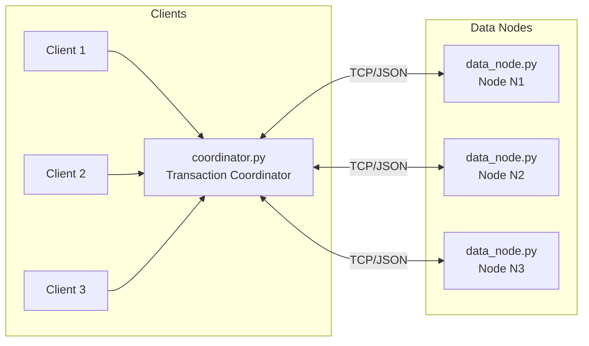
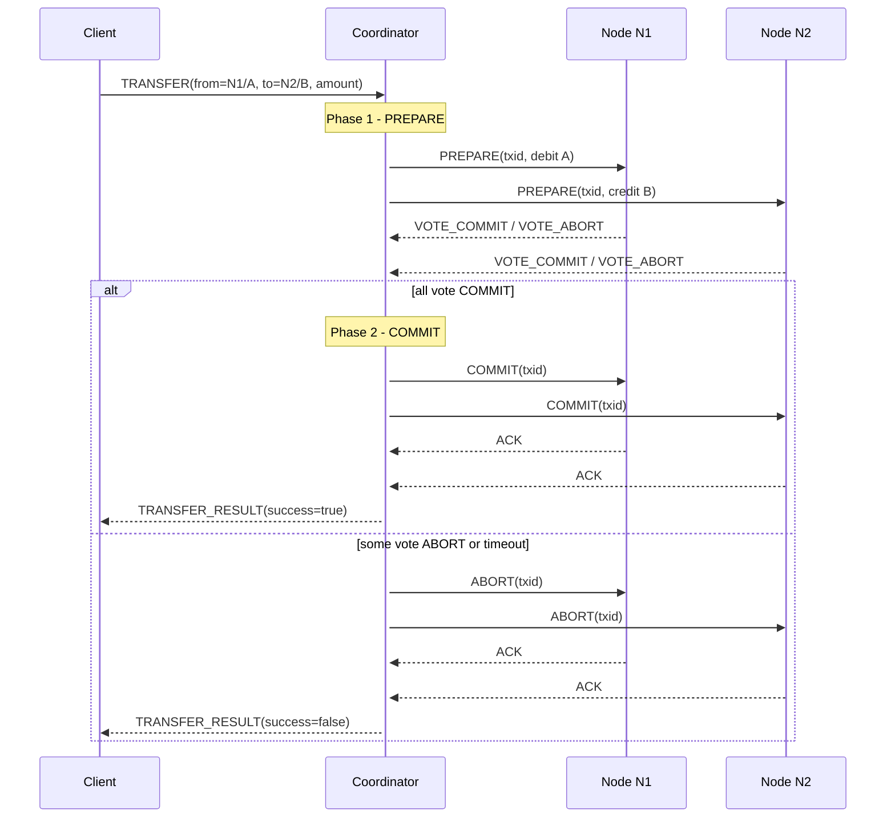

## Distributed Transaction Demo (4 Nodes, Python)

This project is a **small-scale distributed transaction system** implemented in **Python** to illustrate:

- **Atomic distributed transactions** coordinated across multiple nodes
- **Concurrency control** using locks (2PL-style)
- **Failure handling and recovery** with simple write-ahead logging and restart behavior
- A **4-node architecture**: 1 coordinator + 3 data nodes

### Quick Summary: System Components

- **1 Coordinator Node**: `coordinator.py` - manages all distributed transactions
- **3 Data Nodes**: `data_node.py` - labeled as **N1**, **N2**, **N3** (each stores account data on different ports)
- **Multiple Clients**: `client.py` - run as many instances as you want (no fixed number)

**Note**: Each `data_node.py` and `client.py` script can be run multiple times to create multiple instances. The data nodes are specifically labeled (N1, N2, N3), while clients don't need labels.

It is designed to match the assignment requirements you provided (transactions, concurrency, and failures) while keeping the code size and concepts manageable.

---

### 1. High-Level Idea

- **Scenario**: We model a **bank transfer** as a transaction:
  - Debit account `A` on one node
  - Credit account `B` on another node
- **System Components**:
  - **`Coordinator`** – The central transaction manager that:
    - Receives transaction requests from clients
    - Orchestrates the **two-phase commit** (2PC) protocol across data nodes
    - Makes the final commit/abort decision to ensure atomicity
    - Does NOT store account data (only coordinates transactions)
  - **`Data Nodes`** – `N1`, `N2`, `N3` – Each stores a subset of accounts and enforces **locking** and **local checks**
  - **`Clients`** – Multiple instances that initiate transactions (e.g., bank customers, ATM users, or banking applications requesting transfers)
- **Atomicity**:
  - Either **both debit and credit happen** (all nodes commit)
  - Or **nothing happens** (all nodes abort)
- **Concurrency control**:
  - Nodes use **per-account locks** to serialize conflicting updates (basic **2-phase locking** style).
- **Failure handling**:
  - Nodes use a **write-ahead log** plus **state file**.
  - If a data node crashes and restarts, it can still **resume from its last committed state**, and in-flight transactions are safely aborted from the coordinator’s point of view.

---

### 2. Architecture Diagram

The system consists of **4 main processes** (plus multiple clients):

- **1 Coordinator Node**: `coordinator.py` - manages distributed transactions
- **3 Data Nodes**: `data_node.py` - labeled as **N1**, **N2**, **N3** (each stores account data)
- **Multiple Clients**: `client.py` - can run many instances concurrently (the diagram shows 3 as an example: Client 1, Client 2, Client 3)

#### 2.1 System Architecture Diagram

The following diagram shows the **high-level system architecture** and how components interact:



**What this diagram shows:**

- **Clients** (left side): Multiple client processes (`client.py`) can run concurrently. The diagram shows **3 clients** (Client 1, Client 2, Client 3) as an example, but you can run as many as needed. Each client:
  - Represents an entity that initiates transactions (e.g., a bank customer, ATM user, or banking application)
  - Initiates transactions (bank transfers between accounts) by sending `TRANSFER` requests to the coordinator over TCP/JSON
  - Note: Clients initiate **transfers** (moving money from one account to another), not just withdrawals. A withdrawal would be a special case of a transfer.
  - Runs independently in separate terminal windows or processes
  - Can send concurrent requests to test the system's concurrency control

- **Coordinator** (middle): The `coordinator.py` process acts as the central transaction manager. It:
  - Receives transaction requests from clients
  - Orchestrates the two-phase commit protocol across data nodes
  - Makes the final commit/abort decision to ensure atomicity
  - Does NOT store account data itself (only coordinates)

- **Data Nodes** (right side): **Exactly 3 independent `data_node.py` processes**, labeled as:
  - **N1** (Node 1) - runs on port 6001
  - **N2** (Node 2) - runs on port 6002
  - **N3** (Node 3) - runs on port 6003
  - Each data node:
    - Stores actual account balances (partitioned across nodes)
    - Process sub-transactions (debits/credits) for accounts they manage
    - Uses locks for concurrency control
    - Persists state to disk for crash recovery

- **Communication**: All communication uses TCP sockets with JSON-encoded messages. The coordinator communicates bidirectionally with each data node to execute the 2PC protocol.

#### 2.2 Transaction Flow Sequence Diagram (2PC Protocol)

The following sequence diagram illustrates **exactly what happens** during a single distributed transaction:



**What this sequence diagram shows:**

1. **Client Request**: A client sends a `TRANSFER` request to the coordinator specifying:
   - Source: `N1/A` (account A on node N1)
   - Destination: `N2/B` (account B on node N2)
   - Amount to transfer

2. **Phase 1 - PREPARE** (Voting Phase):
   - Coordinator generates a unique transaction ID (`txid`)
   - Coordinator sends `PREPARE` messages to **both involved nodes** (N1 and N2)
   - Each node:
     - Acquires locks on the affected account(s)
     - Validates the operation (e.g., checks if debit would cause negative balance)
     - Logs the prepare intent
     - Replies with `VOTE_COMMIT` (if feasible) or `VOTE_ABORT` (if not)

3. **Phase 2 - COMMIT or ABORT** (Decision Phase):
   - **If all nodes vote COMMIT**:
     - Coordinator sends `COMMIT` messages to all involved nodes
     - Nodes apply the changes permanently (update balances, persist to disk)
     - Nodes send `ACK` back to coordinator
     - Coordinator returns `success=true` to the client
   - **If any node votes ABORT or times out**:
     - Coordinator sends `ABORT` messages to all involved nodes
     - Nodes release locks and discard the prepared changes
     - Nodes send `ACK` back to coordinator
     - Coordinator returns `success=false` to the client

4. **Atomicity Guarantee**: The transaction is **all-or-nothing**:
   - Either both debit (N1) and credit (N2) happen together
   - Or neither happens (both abort)
   - This ensures the system never enters an inconsistent state where money disappears or appears from nowhere

---

### 3. Components and Responsibilities

- **`coordinator.py`**
  - TCP server accepting **client connections**.
  - Implements **two-phase commit** across the nodes:
    - Phase 1 (**PREPARE**): ask each involved node if the transaction is locally feasible.
    - Phase 2 (**COMMIT/ABORT**): commit at all prepared nodes or abort at all.
  - Manages a **simple timeout** and logs failures to reach nodes.

- **`data_node.py`** - **3 instances** (labeled **N1**, **N2**, **N3**)
  - Each instance is a TCP server that receives **PREPARE, COMMIT, ABORT, READ** messages.
  - Keeps an **in-memory account map**: account ID → integer balance.
  - Uses **per-account locks** to implement basic **2-phase locking** (2PL-like) for concurrent transactions.
  - Uses a **write-ahead log** plus **state file** for recovery:
    - State file: current persisted balances.
    - Log file: append-only records of changes and transaction events.
  - **Node Labels**: When you run `data_node.py`, you specify `--node-id N1` (or N2, N3) to label each instance.

- **`client.py`** - **Multiple instances** (no fixed limit)
  - Simple **CLI client** that represents an entity initiating transactions (e.g., bank customer, ATM user, banking application).
  - Connects to the coordinator and sends a `TRANSFER` request to move money between accounts.
  - **What clients do**: Clients initiate **bank transfers** (not just withdrawals):
    - Transfer money from one account to another (e.g., from `N1/A` to `N2/B`)
    - Could represent: a customer transferring between accounts, an ATM withdrawal/deposit, or any banking transaction
  - Multiple instances can be run concurrently from different shells to model multiple clients.
  - Each client instance is independent and can initiate transactions simultaneously.
  - **No labels required**: Clients don't need IDs; they just connect and send requests.

- **`common.py`**
  - Utility functions for **JSON-over-TCP** (`send_json`, `recv_json`).

---

### 4. How the Protocol Works (Conceptual View)

#### 4.1 Transaction Model

- A **transaction** is a logical transfer:
  - `from_node`, `from_account` → **debit**
  - `to_node`, `to_account` → **credit**
  - **Amount** is an integer.
- The coordinator builds a **per-node operation list**:
  - On the `from_node`: `{ account_id: from_account, delta: -amount }`
  - On the `to_node`: `{ account_id: to_account, delta: +amount }`

#### 4.2 Two-Phase Commit (2PC)

1. **Client → Coordinator**
   - Client sends a JSON message:
     - `{"type": "TRANSFER", "from_node": "...", "from_account": "...", "to_node": "...", "to_account": "...", "amount": N}`

2. **Phase 1: PREPARE**
   - Coordinator generates a **transaction ID** (`txid`).
   - Sends a `PREPARE` message to each **involved node**:
     - `{"type": "PREPARE", "txid": txid, "operations": [ ... ]}`
   - Each node:
     - Acquires **locks** for all referenced accounts (sorted order to reduce deadlocks).
     - Simulates the operations on a **temporary balance table**.
     - If any balance would go **negative**, replies `VOTE_ABORT`.
     - If all operations are locally feasible, appends a log record and replies `VOTE_COMMIT`.
   - If a node is unreachable or times out, the coordinator treats it as **`VOTE_ABORT`**.

3. **Phase 2: COMMIT or ABORT**
   - If **all nodes vote `VOTE_COMMIT`**:
     - Coordinator sends `COMMIT(txid, operations)` to each involved node.
     - Each node:
       - Applies the deltas **for real** (with logging and persistence).
       - Sends back `ACK`.
   - Otherwise (any `VOTE_ABORT` or failure):
     - Coordinator sends `ABORT(txid)` to each involved node.
     - Nodes log the abort and release locks.

4. **Coordinator → Client**
   - Client receives `TRANSFER_RESULT`:
     - `{"type": "TRANSFER_RESULT", "success": true/false}`

---

### 5. Concurrency Control Strategy

- Each `data_node.py` uses:
  - A **dictionary of balances**, e.g., `{"A": 100, "B": 50, ...}`
  - A **dictionary of locks**, one per account.
- On **PREPARE**:
  - Node **locks all involved accounts** in a sorted order.
  - Simulates updates on temporary balances.
  - On success:
    - Logs a `prepare_ok` record.
    - Sends `VOTE_COMMIT`.
  - On failure (e.g., negative balance):
    - Sends `VOTE_ABORT`.
  - Locks are released at the end of PREPARE.
- On **COMMIT**:
  - For each operation:
    - Acquires the account lock.
    - Logs the delta in the write-ahead log.
    - Updates the in-memory balance.
    - Writes updated state to the state file.
    - Releases the lock.
- This corresponds to a **basic 2PL-like mechanism**: locks are taken during critical sections to prevent concurrent conflicting accesses, ensuring **serializable** behavior for this simple workload.

---

### 6. Failure Handling and Recovery

This implementation demonstrates **failure scenarios and recovery behavior**, at a conceptual level:

- **Data-node crash**:
  - A node maintains:
    - A **state file**: last committed account balances.
    - A **log file**: append-only records of transaction events and updates.
  - If a node process is **killed**:
    - In-memory state for in-flight transactions is lost.
    - But the **persisted state** remains consistent because:
      - Data is written before or during commit.
      - No partial writes across transactions are exposed.
  - On **restart**:
    - Node reloads the **state file** (last consistent snapshot).
    - Any transaction that was in PREPARE but not committed is effectively **aborted** (coordinator will time out and abort).

- **Coordinator sees node failure**:
  - If a node does not respond to **PREPARE** or **COMMIT**:
    - Coordinator interprets this as a **vote to abort**.
    - Sends `ABORT` to all other involved nodes.
    - Reports `success=false` to the client.

- **Coordinator crash and recovery**:
  - The coordinator maintains a **transaction log file** (`data/coordinator_tx_log.jsonl`) that records:
    - Transaction start (`START`)
    - Prepare phase (`PREPARE`)
    - Commit/abort decisions (`COMMIT`, `ABORT`)
    - Transaction completion (`COMPLETE`)
  - **On coordinator restart**:
    - The coordinator scans the log for incomplete transactions (those that reached `PREPARE` or `COMMIT` but never reached `COMPLETE` or `ABORT`)
    - For each incomplete transaction, the coordinator sends `ABORT` messages to all involved nodes
    - This ensures nodes never remain in an uncertain state (they only commit when explicitly told to)
  - **Why this works**:
    - Nodes never commit without an explicit `COMMIT` message from the coordinator
    - If the coordinator crashes after sending `PREPARE` but before `COMMIT`, nodes remain in a prepared state
    - On recovery, the coordinator aborts these incomplete transactions, ensuring consistency
    - The system resumes normal operation after recovery completes

---

### 7. Installation and Setup

#### 7.1 Prerequisites

- **Python 3.10+** (standard library only; no third-party packages required).
- A shell (PowerShell, cmd, or any terminal).

#### 7.2 Clone or Extract the Project

Place all files in a directory, e.g.:

- `common.py`
- `data_node.py`
- `coordinator.py`
- `client.py`
- `requirements.txt`
- `README.md`

#### 7.3 (Optional) Virtual Environment

You can create and activate a virtual environment:

```bash
python -m venv venv
venv\Scripts\activate  # Windows
```

No additional `pip install` commands are required because everything uses the standard library.

---

### 8. Using the Tkinter GUI (Control Panel)

The project includes a GUI control panel (gui_app.py) to run the full system with one window. It provides tabs for process control, operations, logs, state viewing, and failure/recovery demos.

Launch
- Windows/macOS/Linux:
  - python gui_app.py

Title: "Distributed Store Control Panel (GROUP THREE)" with a blue-toned dark theme, larger fonts, and horizontal scrolling in logs/results/state views.

Start processes
- Coordinator
  - Set Coord host and Coord port (defaults 127.0.0.1:5000).
  - Node controls define the nodes map (count and base port). Click Start Coordinator.
- Nodes
  - Set Nodes (count) and Base port (default base 6001). Click Start Nodes to launch N1..N{count}.

Operations tab
- Operation = read_balance
  - Node (e.g., N1) and Account (e.g., A). Click Execute. The result appears in Results.
- Operation = transfer
  - From Node/Account, To Node/Account, Amount. Click Execute to run client.py via the coordinator.

Concurrency demos
- Run concurrent transfers (3 clients): launches three transfers concurrently.
- Run conflicting locks demo (2 clients): runs two transfers that conflict on N2/B to show lock serialization.

Logs tab
- Live, aggregated logs (stdout/stderr) for Coordinator and Nodes with prefixes. Horizontal and vertical scroll supported.

State Viewer tab
- Lists files under data/*. Click to preview content with JSON pretty-printing and horizontal/vertical scrolling.

Failures / Recovery tab
- Delay (ms), Node to crash, Coordinator fail at (None/PREPARE/BEFORE_COMMIT/AFTER_COMMIT), Coord fail delay (ms).
- Start transfer, then crash COORDINATOR: starts a transfer then crashes/restarts the coordinator on timing.
- Start transfer, then crash NODE (selected): starts a transfer then crashes/restarts the selected node.
- Use PREPARE to force abort-on-recovery; AFTER_COMMIT to demonstrate durability.

Close
- Closing the window stops the coordinator and all nodes cleanly.

For detailed recovery recipes and evidence to collect, see RESULTS.md section "Using the Failure/Recovery Panel Effectively (Crash Timing Recipes)".

---

### 8. Running the 4-Node System

We will run:

- **3 data nodes** (labeled **N1**, **N2**, **N3**) on ports `6001`, `6002`, `6003`.
- **1 coordinator** on port `5000`.
- **Multiple clients** (no fixed number - run as many as you want) that connect to the coordinator.

#### 8.1 Start Data Nodes (N1, N2, N3)

**Important**: You need to run `data_node.py` **3 separate times** in **3 different terminal windows**. Each instance is a separate process representing one data node.

Open **three separate terminal windows** (or PowerShell tabs) and run:

**Terminal 1 (Node N1):**
- Change: `--node-id N1` and `--port 6001`

```bash
python data_node.py --node-id N1 --port 6001 --data-dir data
```

**Terminal 2 (Node N2):**
- Change: `--node-id N2` and `--port 6002`

```bash
python data_node.py --node-id N2 --port 6002 --data-dir data
```

**Terminal 3 (Node N3):**
- Change: `--node-id N3` and `--port 6003`

```bash
python data_node.py --node-id N3 --port 6003 --data-dir data
```

**What changes between each run:**
- `--node-id`: Changes from `N1` → `N2` → `N3` (this labels each node)
- `--port`: Changes from `6001` → `6002` → `6003` (each node needs a unique port)
- `--data-dir`: Stays the same (`data`) - each node creates its own files inside this directory

Each node will create:

- `data/node_NX_state.json`
- `data/node_NX_log.jsonl`

#### 8.2 Start the Coordinator

Open **another terminal** and run:

```bash
python coordinator.py --port 5000 --nodes N1:127.0.0.1:6001,N2:127.0.0.1:6002,N3:127.0.0.1:6003
```

The coordinator will now:

- Listen on `127.0.0.1:5000` for client connections.
- Know how to reach the three data nodes.

#### 8.3 Initialize Some Balances (Optional)

By default, accounts start with balance `0`. To **seed balances**, you can:

1. Run a few transactions that credit an account (e.g. transfer from a dummy node), or
2. Manually edit the `node_NX_state.json` files before serious experiments (for assignment demos you can explain this step in your report).

For example, to give `A` on `N1` a balance of `100`:

```json
// data/node_N1_state.json
{
  "A": 100
}
```

Then restart node `N1`.

#### 8.4 Run a Single Transfer

Open **another terminal** and run a client:

```bash
python client.py \
  --coord-host 127.0.0.1 \
  --coord-port 5000 \
  --from-node N1 \
  --from-account A \
  --to-node N2 \
  --to-account B \
  --amount 10
```

On Windows PowerShell you can also write it on one line:

```powershell
python client.py --coord-host 127.0.0.1 --coord-port 5000 --from-node N1 --from-account A --to-node N2 --to-account B --amount 10
```

You should see logs:

- Client: `TRANSFER_RESULT(success=True/False)`
- Coordinator: details of the 2PC run.
- Nodes: PREPARE/COMMIT logs.

---

### 9. Demonstrating Concurrency

**MPESA Analogy**: Think of this system like MPESA (mobile money transfer):
- **Nodes N1, N2, N3** = Different MPESA users/accounts (e.g., Alice's account on N1, Bob's on N2, Charlie's on N3)
- **Coordinator** = MPESA network/system that ensures money transfers are processed correctly
- **Concurrent transactions** = Multiple people trying to send money at the same time
- **Locks** = MPESA system ensuring that if Alice sends money to both Bob and Charlie simultaneously, her account balance is correctly deducted and neither transfer causes a double-spend or negative balance

To show **multiple concurrent clients** and **per-account lock serialization**:

1. Keep all nodes and coordinator **running**.
2. **Demo 1: Simple concurrent transfers** (different accounts):

   **On Windows (PowerShell):**
   ```powershell
   .\demo_concurrent_transfers.ps1
   ```

   **On Linux/Mac (Bash) or Windows (Git Bash/WSL):**
   ```bash
   bash demo_concurrent_transfers.sh
   ```

   This runs three transfers simultaneously:
   - **N1 → N2**: Alice (N1/A) sends 10 to Bob (N2/B)
   - **N2 → N1**: Bob (N2/B) sends 10 to Alice (N1/A)
   - **N3 → N1**: Charlie (N3/C) sends 20 to Alice (N1/A)

3. **Demo 2: Conflicting concurrent transfers** (same accounts - demonstrates per-account locks):

   **On Windows (PowerShell):**
   ```powershell
   .\demo_conflicting_locks.ps1
   ```

   **On Linux/Mac (Bash) or Windows (Git Bash/WSL):**
   ```bash
   bash demo_conflicting_locks.sh
   ```

   This demonstrates **per-account locks serializing conflicting updates** involving all three nodes:
   - **Client 1**: N1/A → N2/B (amount 100) - Alice sends money to Bob (uses N1 and N2)
   - **Client 2**: N2/B → N3/C (amount 150) - Bob sends money to Charlie (uses N2 and N3, conflicts on account B!)
   
   Both transactions involve all three nodes (N1, N2, N3) and conflict on account B on N2. The **per-account locks** in the data nodes will:
   - Use non-blocking lock acquisition: The first transaction locks account B, the second fails immediately if the lock is held
   - Abort on conflict: If Client 2 can't acquire the lock (because Client 1 already holds it), Client 2's transaction aborts immediately rather than waiting
   - Prevent double-spending: Concurrent transactions on the same account cannot proceed simultaneously - one succeeds, the other aborts
   
   **Note**: Make sure account B on N2 has sufficient balance before running this demo. The state file `data/node_N2_state.json` should contain `{"B": <sufficient_balance>}` or similar.

4. **Observe** (like watching MPESA transaction logs):
   - **Multiple transactions** can be processed concurrently by the coordinator
   - **Per-account locks** at data nodes prevent conflicting updates: if Alice sends money to two people at once, the first transaction locks her account and the second fails immediately (prevents double-spending)
   - **No account ever goes negative** if initially set correctly (just like MPESA prevents overdrafts)
   - **Node logs** show concurrent transactions with conflict detection (check `data/node_N1_log.jsonl`, etc.)
   
   In the logs, you'll see:
   - Both transactions start PREPARE phase simultaneously
   - One transaction (Client 1) acquires lock on B (N2) first and proceeds
   - The second transaction (Client 2) fails to acquire the lock and immediately aborts (look for `"action": "prepare_failed", "reason": "lock_contention_on_B"` or similar)
   - Only one transaction completes successfully, preventing race conditions and double-spending
   - All three nodes (N1, N2, N3) are involved in the transactions

---

### 10. Demonstrating Failures and Recovery

**MPESA Analogy**: These scenarios demonstrate what happens when parts of the MPESA network fail:
- **Node crash** = One MPESA user's phone loses network connection or crashes during a transfer
- **Coordinator crash** = The MPESA central system crashes while processing a transaction
- **Recovery** = Ensuring money doesn't disappear or get double-deducted when systems come back online

Here is a **simple step-by-step scenario** you can reproduce and describe:

#### 10.1 Node Crash During Prepare / Commit

**MPESA Scenario**: Alice tries to send money to Bob, but Bob's phone loses connection mid-transaction.

1. Start all nodes and coordinator as above.
2. Make sure `N1/A` has enough balance (e.g., 100) - this is like Alice having money in her MPESA account.
3. Start a transfer client **from `N1/A` to `N2/B`** with amount `50`:
   ```powershell
   python client.py --coord-host 127.0.0.1 --coord-port 5000 --from-node N1 --from-account A --to-node N2 --to-account B --amount 50
   ```
4. While the logs show the coordinator is in **PREPARE** or just about to **COMMIT**:
   - **Force close Node N2** (Ctrl+C the terminal running `N2`) - simulating Bob's phone losing connection.
5. Observe:
   - Coordinator logs a failure to contact N2 (like MPESA system detecting Bob's phone is unreachable).
   - Coordinator treats this as `VOTE_ABORT` (transaction cannot complete).
   - Sends `ABORT` to other nodes (tells Alice's account not to deduct the money).
   - Client sees `TRANSFER_RESULT(success=False)` (Alice receives "Transaction failed" message).

6. Restart `N2` (Bob's phone reconnects):

```powershell
python data_node.py --node-id N2 --port 6002 --data-dir data
```

7. Check the **state files**:
   - Balances should be consistent; no half-committed transfer (Alice's money wasn't deducted, Bob didn't receive anything).

#### 10.2 Node Restart and State Reload

**MPESA Scenario**: A user restarts their phone - their account balance should be exactly as it was before.

1. Stop one node (e.g., `N1`) and inspect its `node_N1_state.json` file (check Alice's account balance).
2. Start the node again (simulating phone restart).
3. Confirm that:
   - Balances are **restored** from the state file (Alice's balance is exactly as it was saved).
   - New transactions continue from that consistent snapshot (can continue making transfers).

#### 10.3 Coordinator Crash and Recovery

**MPESA Scenario**: The MPESA central system crashes while processing a transfer between two users.

This demonstrates the **coordinator crash recovery** mechanism:

1. Start all nodes and coordinator as above.
2. Initiate a transfer transaction (e.g., from `N1/A` to `N2/B`):
   ```powershell
   python client.py --coord-host 127.0.0.1 --coord-port 5000 --from-node N1 --from-account A --to-node N2 --to-account B --amount 30
   ```
3. **While the transaction is in progress** (during PREPARE or COMMIT phase):
   - **Force close the coordinator** (Ctrl+C the terminal running `coordinator.py`) - simulating MPESA central system crash.
4. Observe:
   - The transaction is incomplete (coordinator crashed before sending final COMMIT/ABORT).
   - Data nodes remain in a prepared state but do not commit (they wait for explicit COMMIT - like accounts in limbo, not yet updated).
5. **Restart the coordinator** (MPESA system comes back online):
   ```powershell
   python coordinator.py --port 5000 --nodes N1:127.0.0.1:6001,N2:127.0.0.1:6002,N3:127.0.0.1:6003
   ```
6. Observe the coordinator logs:
   - Coordinator scans `data/coordinator_tx_log.jsonl` for incomplete transactions (checks what transactions were in progress).
   - For each incomplete transaction, it sends `ABORT` to all involved nodes (rolls back any pending transfers).
   - Logs show: `"Found N incomplete transactions from previous run. Aborting them..."` (MPESA system clears any stuck transactions).
7. Verify consistency:
   - Check node state files: balances should be consistent (no partial commits - Alice's money wasn't lost, Bob didn't receive phantom money).
   - The system is now ready to handle new transactions (users can make transfers again).

